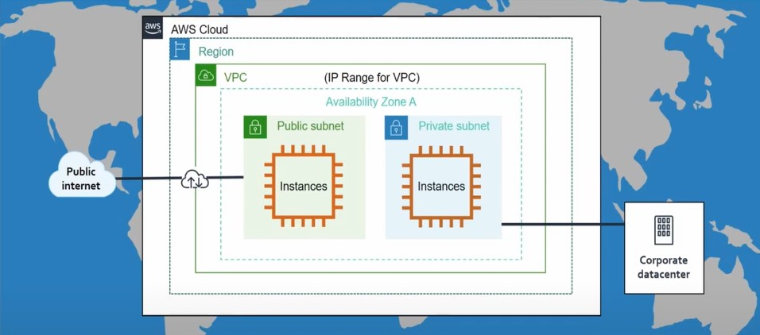
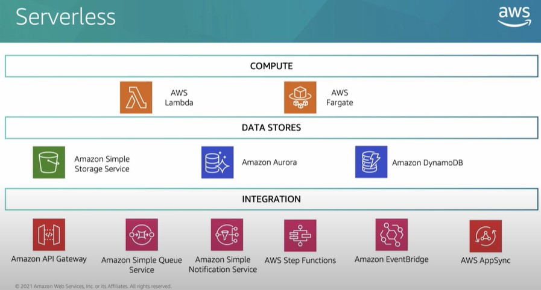

<h1>AWS</h1>
<b>Amazon Web Services (AWS) </b> jest bezpieczną platformą usług w chmurze oferującą moc obliczeniową, hosting baz danych, usługi dostarczania treści (content delivery) i wiele innych produktów i usług pomagających w łatwym skalowaniu i wzroście biznesu.
 
<b>Amazon Simple Storage Service (Amazon S3) </b> jest internetowym nośnikiem danych firmy Amazon, ma prosty w obsłudze interfejs WWW, który umożliwia dostęp do przechowywanych danych oraz obiektów, a także do zarządzania nimi w miejsach nazywanych koszykami (ang. <i>backets</i>). Ilość przechowywanych danych jest praktycznie nielimitowana, natomiast max. wielkość pojedyńczego pliku to 5TB. 
Przykłady zastosowania:
- backups,
- przechowywanie grafik,
- dokumenty (różne rozszerzenia plików),
- nagrania audio, video (media hosting),
- hostowanie stron internetowych (static hosting).

<b>Amazon Elastic Block Store (Amazon EBS) </b> jest to dysk twardy w chmurze, który przechowuje dane w sposób trwały i są one replikowane oraz szyfrowane, a opcja snapshot'ów pozwala robić backup.

<b>Amazon Virtual Private Cloud (VPC) </b> jest to wyizolowana, wirtualna sieć w chmurze. Pozwala na:
- routowanie ruchu,
- tworzenie podsieci,
- nadawania zakresów IP i adresacji.
Zapewnia 2 rodzaje kontroli:
  1. Access Control Lists - kontrola na poziomie całej sieci oraz podsieci sterując, które porty, bloki, reguły są dozwolone,
  2. Security Groups - kontrola przypisana do zasobów, takich jak wirtualny serwer, pozwala na decydowanie kto może mieć dostęp do serwerów.
  
<b>Amazon Elastic Compute Cloud (EC2) </b>  – serwis WWW dostarczający skalowalną moc obliczeniową w chmurze obliczeniowej. Dostęp do zasobów Amazon jest realizowany przez strony WWW, jak również dzięki bezpiecznym połączeniom SSH, które szczególnie przydatne są dla administratorów systemów zainstalowanych w chmurze.



<h2>AWS CloudShell</h2>
- listowanie bucketów:
```shell
aws s3 ls
```
- tworzenie nowego bucketu:
```shell
aws s3 mb s3://<bucket_name>
```
Źródło: https://www.youtube.com/watch?v=yTZUOOshUU0&ab_channel=AWSPolska


<b>Amazon CloudFront </b> to usługa sieci szybkiego dostarczania treści (CDN), która bezpiecznie dostarcza dane, filmy, aplikacje i interfejsy API klientom na całym świecie z niskimi opóźnieniami i wysokimi prędkościami transferu.

<b> Serverless </b> - technologie bez serwera.



<b>Amazon DynamoDB </b>to w pełni zarządzana, zastrzeżona usługa bazy danych NoSQL, która obsługuje kluczowe wartości i struktury danych dokumentów.

<h1>ML</h1>
<b>Amazon Polly</b> jest to usługa, która konwertuje tekst na dźwięk mówiony.
<b>Amazon Rekognition</b> jest to usługa, która zajmuje się obrazem. Funkcjonalności:
- detekcja obiektów,
- analiza twarzy: płeć, wiek, emocje,
- Personal Protective Equipment (PPE) - np. detekcja, czy osoba na zdjęciu ma maseczkę ochronną,
<b>Amazon Forecast</b> jest to usługa, która na podstawie danych historycznych zwraca prognozę.

