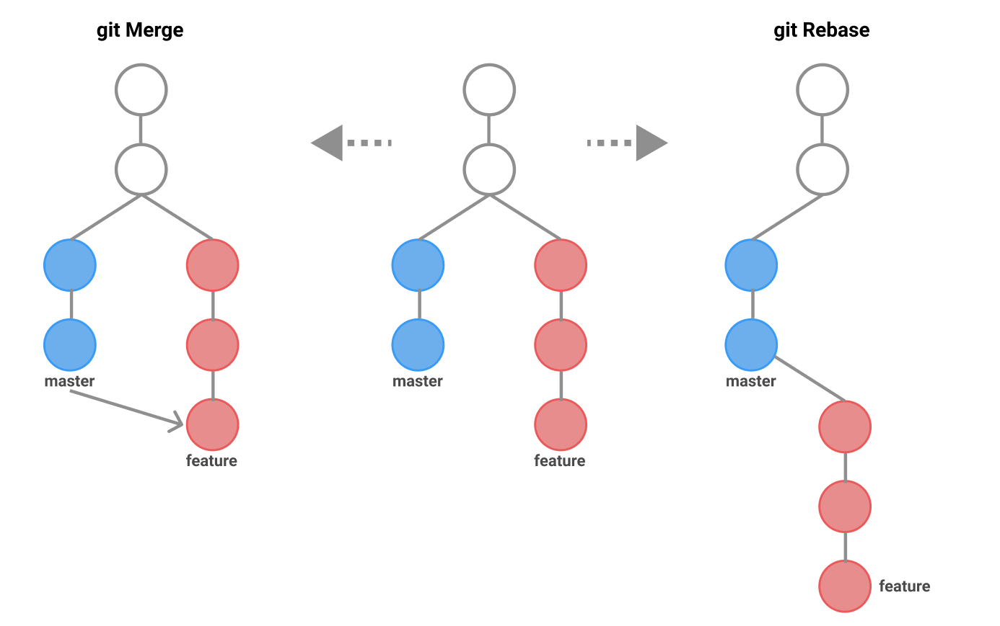

# Zbiór komend git
### Przejście na zmiany konkretnego commit'a:
```bash
git checkout <commit_id>
```
### Przełączenie na poprzednią gałąź:
```bash
git checkout -
```
### Przywracanie zmian z konkretnego commit'a:
```bash
git revert <commit_id>
```

### Przeniesienie zmian z poprzednich commit'ów do przestrzeni roboczej i usunięcie commit'ów z historii:
```bash
git reset <commit_id>
```

Parametry:
1. soft - dodanie zmian z poprzednich commit'ów do staging'u i usunięcie commit'ów z historii,
2. hard - usunięcie zmian i commit'ów z historii.

### Modyfikacja commit'ów:
```bash
git commit --amend -m "Nowa wiadomość"  # Zmiana wiadomości ostatniego commita
git commit --amend --add <file_name>    # Dodanie plików do ostatniego commita
```

Archiwizacja projektu:
```bash
git archive <commit_id/tag> | gzip > "<path_to_archives>(.tar.gz/.zip)"
git archive -o "<path_to_zip>.tar.gz" <commit_id/tag>
git archive -o "<path_to_zip>.tar.gz" HEAD <folder_name>
```
Parametry:
1. prefix <folder_name/>- umieszczenie plików projektu w folderze, 
2. prefix <name>- dodanie prefiksu do wszystkich nazw plików w projekcie,
3. (<folder_name/> / file_name)  - umieszczenie w archiwum tylko konkretnego folderu/pliku.

Oczywiście, rozwinę to trochę bardziej:

### Łączenie zmian na gałęziach za pomocą Git Rebase:
```bash
git rebase <branch_name>
```
Komenda `git rebase` służy do przemieszczania zmian z gałęzi o nazwie `<branch_name>` na obecną gałąź. Jest to proces, który "przeciąga" zmiany z jednej gałęzi i "kładzie" je na drugiej gałęzi. W wyniku tego operacji zmiany z gałęzi źródłowej (np. `feature_branch`) zostają nakładane na gałąź docelową (np. `main`) jedna po drugiej. Historia commitów na gałęzi docelowej wydaje się bardziej liniowa, ponieważ zmiany z gałęzi źródłowej są "przesuwane" na koniec historii gałęzi docelowej.

Przykład: Wykonanie `git rebase feature_branch` na gałęzi `main` spowoduje, że zmiany z `feature_branch` zostaną przeniesione na gałąź `main`, tworząc nowe commity na gałęzi `main`.

### Łączenie zmian na gałęziach za pomocą Git Merge:
```bash
git merge <branch_name>
```
Komenda `git merge` służy do dodawania zmian z gałęzi o nazwie `<branch_name>` do obecnej gałęzi. Jest to proces, który tworzy nowy commit, który zawiera zmiany z gałęzi źródłowej. Historia commitów na gałęzi docelowej zostaje zachowana, a nowe commity reprezentują zmiany z gałęzi źródłowej.

Przykład: Wykonanie `git merge feature_branch` na gałęzi `main` spowoduje dodanie zmian z `feature_branch` do `main` jako nowego commita na gałęzi `main`.

Podsumowując, różnica między `git rebase` a `git merge` polega na tym, jak są łączone zmiany:



- `git rebase` przesuwa zmiany z gałęzi źródłowej na gałąź docelową, tworząc liniową historię commitów.
- `git merge` tworzy nowy commit na gałęzi docelowej, zachowując historię obu gałęzi.

Wybór między tymi dwoma metodami zależy od preferencji i wymagań projektu, ale warto zrozumieć, jak każda z tych operacji wpływa na historię commitów w projekcie.

### Dodanie zmian:
```bash
git cherry-pick <commit_id>         # Dodanie zmian z <commit_id>
git cherry-pick -n <commit_id>      # Dodanie zmian z <commit_id> tylko do obszaru staging, bez nowego commita

```

### Tagi:
```bash
git tag v1.0.0                     # Utworzenie tagu na aktualnym commicie
git show v1.0.0                    # Pokazanie informacji o tagu
git tag v0.9.0 <commit_id>         # Utworzenie tagu na <commit_id>
git tag                            # Wylistowanie wszystkich tagów
git tag -f v0.9.0 <new_commit_id>  # Przeniesienie tagu na <new_commit_id>
git push origin v1.0.0             # Wypchnięcie tagu do zdalnego repozytorium
git push --tags                    # Wypchnięcie wszystkich tagów
git tag -d v0.9.0                  # Usuwanie tagu
git push -d origin v0.9.0          # Usuwanie tagu ze zdalnego repozytorium

```
### Logi:
```bash
git log -3                         # 3 ostatnie commity
git log --author=<nazwa>           # Listuje commity danej osoby
git log --before "2021-06-15"      # Listuje commity sprzed 15 czerwca (opcja --after jest do listowania commitów po danej dacie)
git log --after "2021-06-14" --before "2021-06-16"
git log -p                         # Więcej informacji o commitach
git log -3 -p                      # Więcej informacji dla 3 ostatnich commitów
git log --stat                     # Statystyki dodanych/usuniętych linii
git log --graph                    # Graf z commitami
git log --oneline --graph          # Graf z commitami z mniejszą ilością informacji
git log --pretty="Hash: %H, Autor: %aN"
git log --grep=".css"              # Wyszukiwanie słów
```

### Wejście w tryb interaktyny:
```bash
git rebase -i HEAD~4              # Otwarcie trybu interaktywnego, widok na 4 ostatnie commity
```

Wyjście z trybu interaktywnego:
Esc :x


